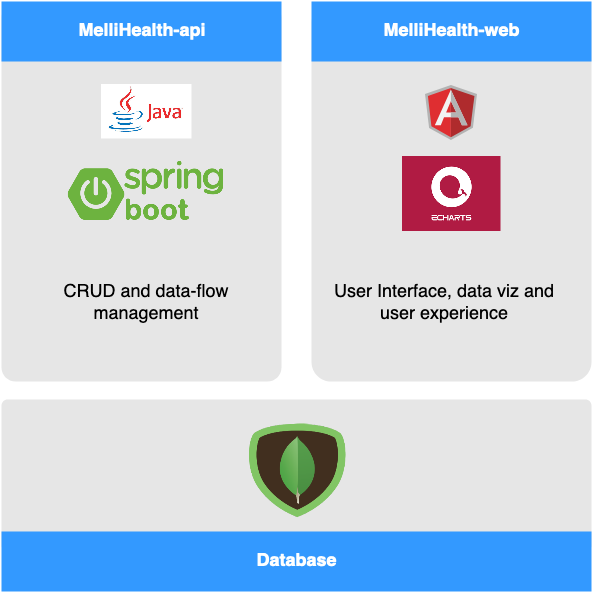

# Mellisphera web

This is the front end of MelliHealth beekeeping platform. 
It is closely linked with [mellihealth-api](https://github.com/mellisphera/mellihealth-api) backend.
An overview of the whole architecture is given below :



## Give it a test
Go to [bzz.mellisphera.com](https://bzz.mellisphera.com)
create an account and visit a demo apiary


## Getting Started

These instructions will get you a copy of the project up and running on your local machine for development and testing purposes. See deployment for notes on how to deploy the project on a live system.

### Prerequisites

You need to install the following items:

```
node.js v10.15.0
npm     v6.4.1
angular  v6.1.10  
angular cli v7.3.9
```
The following libraries are used
- bootstrapp v3.4.1
- echarts v4.2.1

see package.json for other modules

### Run it for the first time
Run `npm install` to set up all modules.\
Launch the app on development mode with `ng serve`
Navigate to `http://localhost:4200/`.\


## Install the back-end API
To have the whole platform running you need to install the back-end API.\
See details at [mellihealth-api](https://github.com/mellisphera/mellihealth-api).

## Need help?
if something goes wrong, contact us at info@mellisphera.com we'll be glad to help.

## Wish to contribute?
Please review [CONTRIBUTING](https://github.com/mellisphera/mellihealth-web/blob/master/CONTRIBUTING.md) 

## License
All source code in this project is licensed under the [Apache license 2.0](https://apache.org/licenses/LICENSE-2.0).

Mellisphera ™ brand and logo are registered trademarks of lema-bkr sarl. 

All the icons and graphic designs are licensed under Creative Commons CC-BY-NC as described in [license_cc](https://github.com/mellisphera/mellihealth-web/blob/master/LICENSE_CC)
=======
# Cleanversion

This project was generated with [Angular CLI](https://github.com/angular/angular-cli) version 6.1.2.

## Download application

Install Git on Linux : run `sudo apt-get install git`.
Install Git on Mac : run `brew install git`.

Run the following command to recover the folder : `git clone https://github.com/mellisphera/mellihealth-web.git`.

## Install Angular

On Linux :

First you have to get nvm (Node Version Manager) [bash script](https://github.com/nvm-sh/nvm) : `curl -o- https://raw.githubusercontent.com/nvm-sh/nvm/v0.34.0/install.sh | bash`.
Then check that it return "nvm" when you launch the command `command -v nvm`.
Install node.js : `nvm install 10.15.0`.
Finally install Angular : `npm install @angular/cli@latest -g`.

On Mac :

Install node.js : `brew install nodejs`.
Install npm : `brew install npm`.
Finally install Angular : `npm install @angular/cli@latest -g`.

## Development server

Run `ng serve` for a dev server. Navigate to `http://localhost:4200/`. The app will automatically reload if you change any of the source files.

## Code scaffolding

Run `ng generate component component-name` to generate a new component. You can also use `ng generate directive|pipe|service|class|guard|interface|enum|module`.

## Build

Run `ng build` to build the project. The build artifacts will be stored in the `dist/` directory. Use the `--prod` flag for a production build.

## Running unit tests

Run `ng test` to execute the unit tests via [Karma](https://karma-runner.github.io).

## Running end-to-end tests

Run `ng e2e` to execute the end-to-end tests via [Protractor](http://www.protractortest.org/).

## Further help

To get more help on the Angular CLI use `ng help` or go check out the [Angular CLI README](https://github.com/angular/angular-cli/blob/master/README.md).

## Edit the code with Visual Studio Code

On Internet : [Visual Studio Code](https://code.visualstudio.com/Download).
Double click on the downloaded file to open a window where you will download the software.
